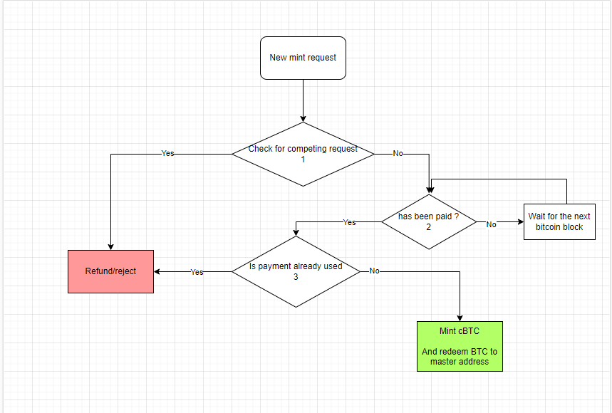
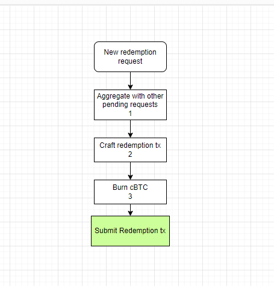

**Guardian angels:**

Guardian angels are autonomous agents that control the AnetaBTC bridge, each one will have its own Bitcoin and Cardano full nodes and indexers and will be running with a private key for each of the networks derived from a single seed-phrase.

Recommended specs : 

* 16Gb Ram  
* 8 CPU Cores  
* 300 Gb Storage (600Gb recomended)

Recommended setup:

Docker compose with : 

1. Bitcoin node  
2. Cardano Dolos node  
3. mongoDB  
4. The guardian software   
     
Operational Specs:

* Maximum of 16 Guardian Angels  
* At least half required for signing  
* Transactions are only considered valid after they are finalized 

**Process:**

Incoming mint-request:  

In the mint request the UTxO will contain the following datum: 

	[<Integer:Amount to mint in Sats>,<Integer:Payment Path>] 

In the minting Transaction the following Metadata will be attached:

	{ “85471236584” :   
	 	{ “Payment” : [<Sting:The Bitcoin Utxos paying for the mint>] }  
	}

\*1 \= Check that no other UTxOs are open requesting a mint in the same payment Path  
\*2 \= Check the address corresponding to the derivation path for payment  
\*3 \= Checks all cBTC mint history and pending mints for competing UTxO claim

Incoming redeem-request:   

In the redemption request the UTxO will contain the following datum:  
\[\<String:Bitcoin address\>\]

The cBTC burn transaction will contain the following metadata:   
{“85471236585”: \<String: TxHash of the redemption tx\>  
}

If redemption txs take longer than  4 hours to be included in a block we will use a pay-by-child to fulfill the requests in the redemption que, if no redemption requests are pending then we will perform a consolidation transaction for the pay-by-child.

*1 = Aggregating requests will lower the Bitcoin Tx fees and alleviate contention concerns

**Internal services:** 

Bitcoin Watcher: keeps track of block height, onNewblock updates the UTxOs and signals the coordinator.  
Cardano Watcher: Indexes the Cardano chain and signals the coordinator.  
Coordinator: receives signals, crafts and signs transactions, signals the Communicator to propagate signatures.   
Communicator: Opens p2p connections to other Guardian angels,  Signals the coordinator with incoming verified signatures, gossips with networks to form a consensus on the BTC fee and implements the consensus .

	  
**Consensus games:**

For non-deterministic decisions the quorum of active validators must be able to agree on a decision in a way that is BFT.

**Recommended algorithm for fee prediction: ( Not Implemented)**

1\) Leader starts a new polling  
2\) Each guardian sends a vote with the timestamp \+ fee signed with their private key to the leader  
3\) Leader gathers new fee votes and sends the as a package to all the followers   
4\) Fee vote is calculated by the mean of the votes , excluding votes that are too far from the mean   
5\) 

This should protect the protocol from malicious actors trying to change the fee by eliminating any value too far away from the mean, giving ⅔ BFT protection.

As a backup measure a hard upper limit will be set above above which no node will accept.

**Leader Selection Algorithm:**

We are using a modified variant of the hhRaft protocol, utilizing CIP-8 for signing and authentication of messages and Votes. 

Nodes are order-ranked according to their position in the topology file, the topology file must be identical on all nodes. Nodes will always vote for the first Node in the list that is connected and active. 

A Node that does not perform its duties or tries to perform illegal actions, will be penalized, kicked out of the quorum and given a lengthy timeout before allowed to connect to other nodes again. 

Penalization of misbehaving nodes will trigger a special process that delivers a notification to the node-operators in their chosen communication channel. (Email or telegram)  

Each node must be validating every transaction request it receives from the leader and ensuring that it is aligned with what they would do if they where the leader 

**Connection:**

We are utilizing full duplex communication using socker.io as the transport protocol. Each node creates an incoming and outgoing connection to each other node. 

Signals are sent from the outgoing connection and processed on the incoming connections. Incoming connections do not accept any signals until authentication is completed. 

**Handshake:**   
1\) Initiator opens socket  
2\) Listener sends challenge  
3\) Initiator signs challenge and replies with solution  
4\) Listener validated challenge and sends an acknowledgment 
